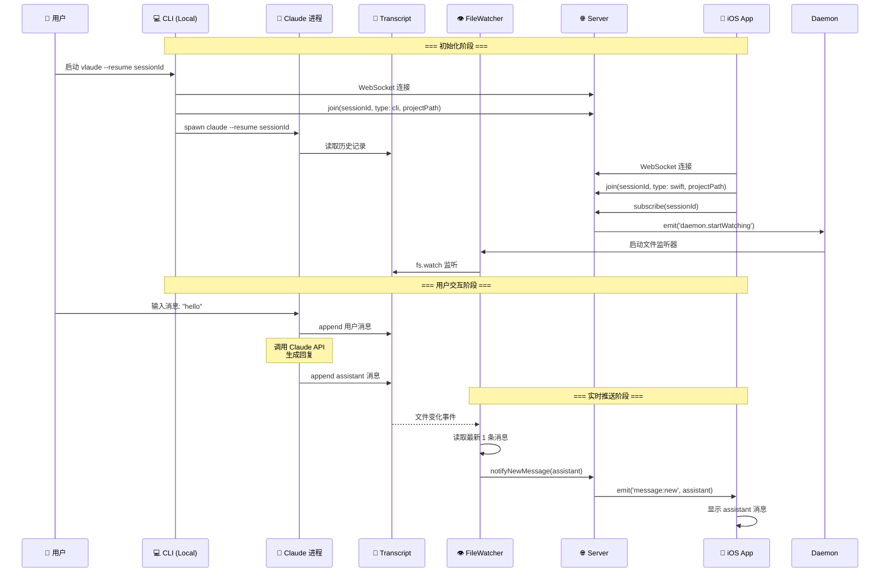
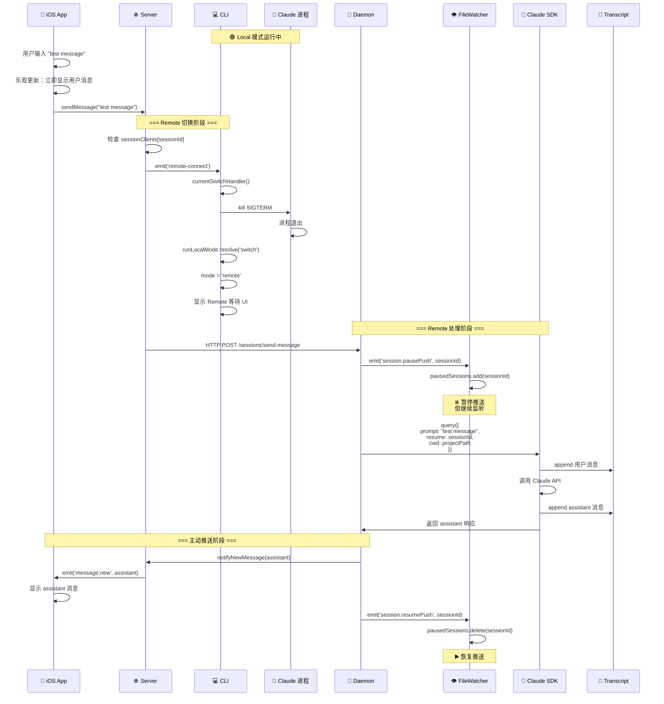
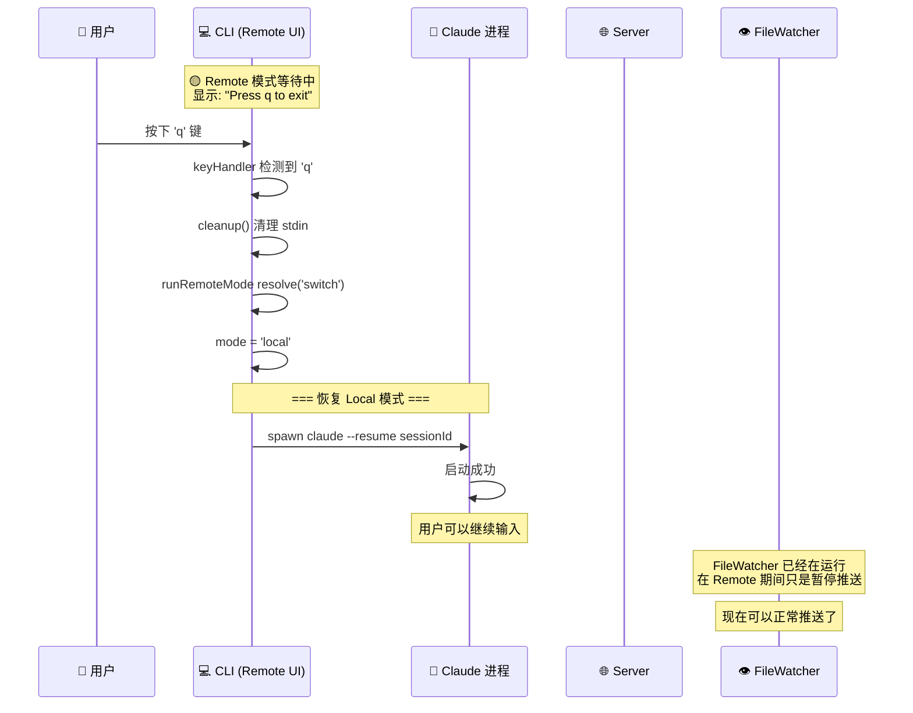
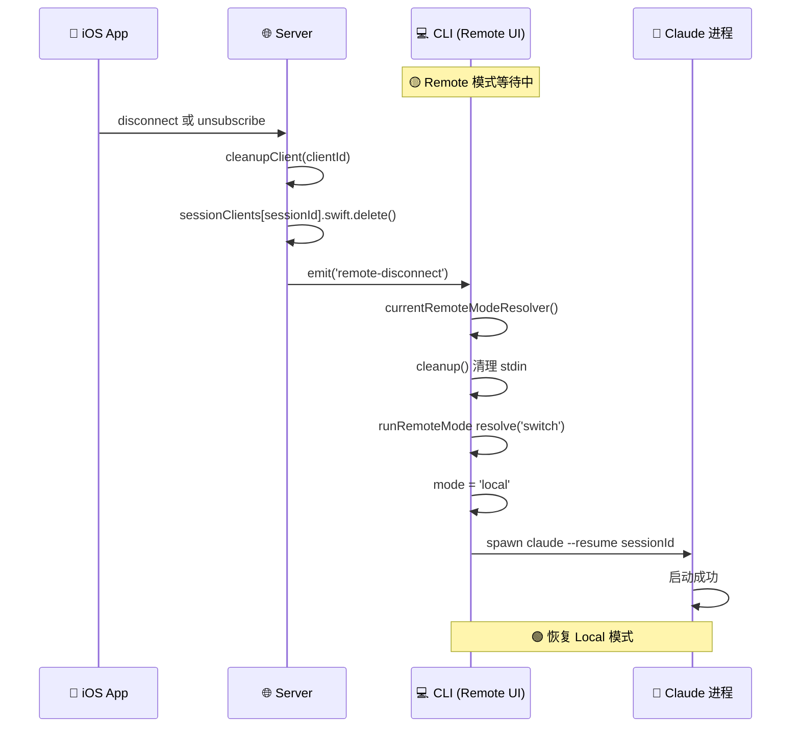
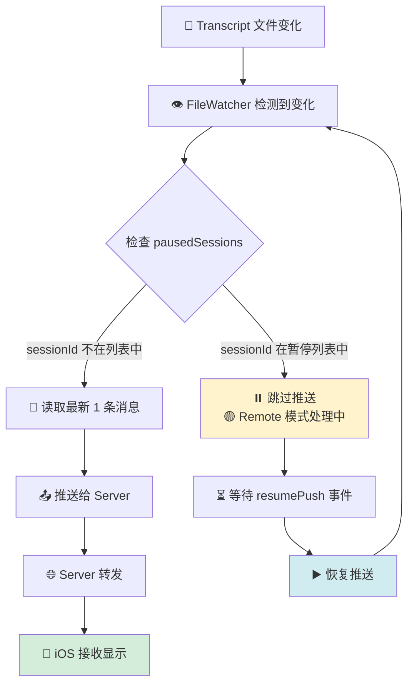
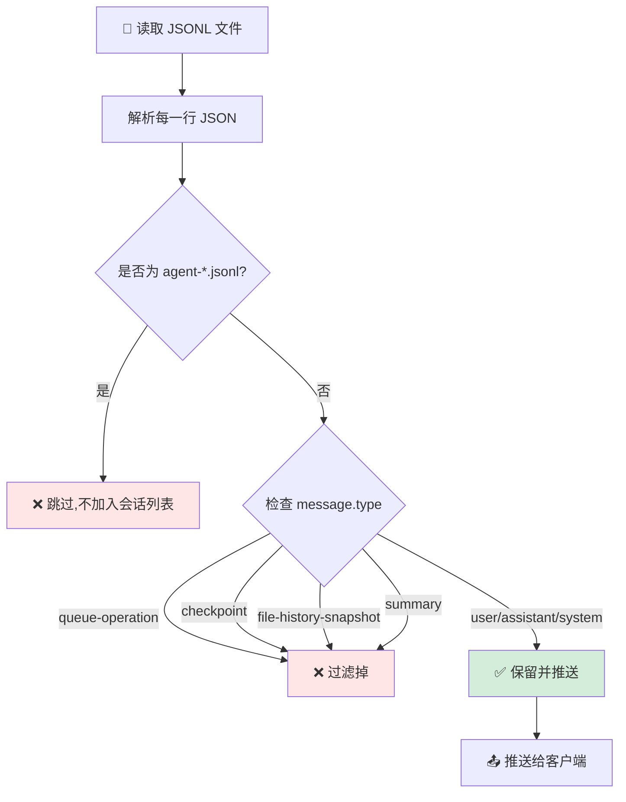
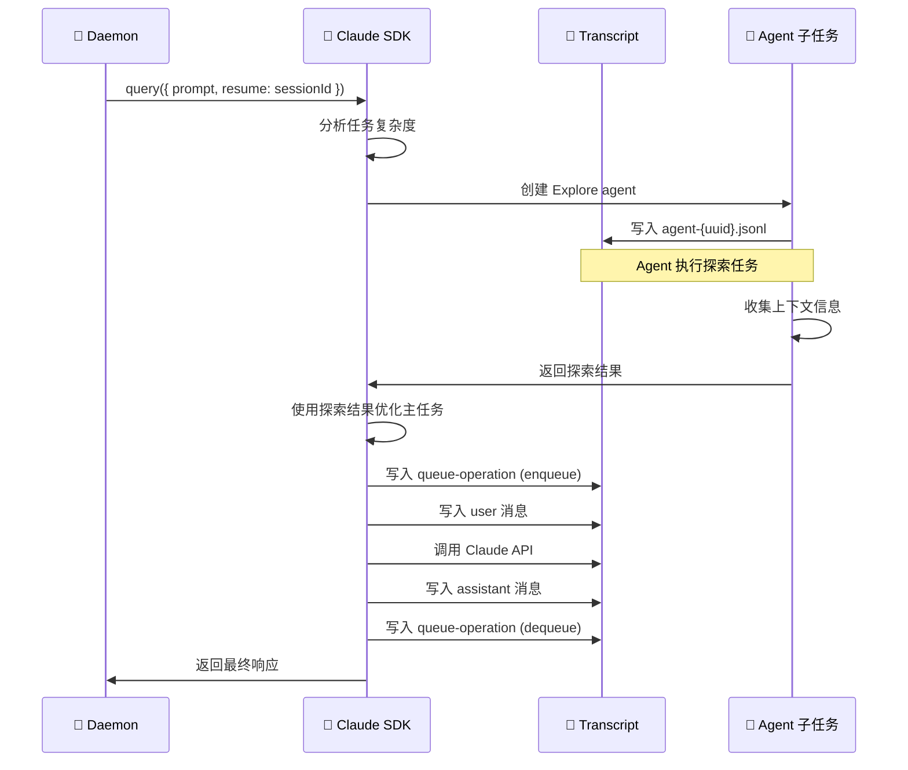
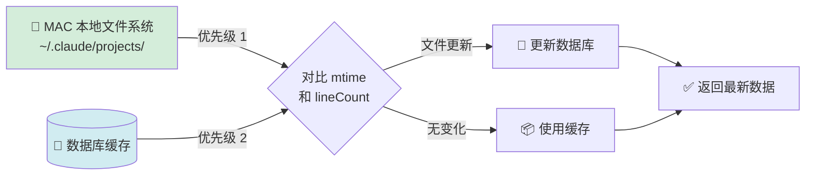
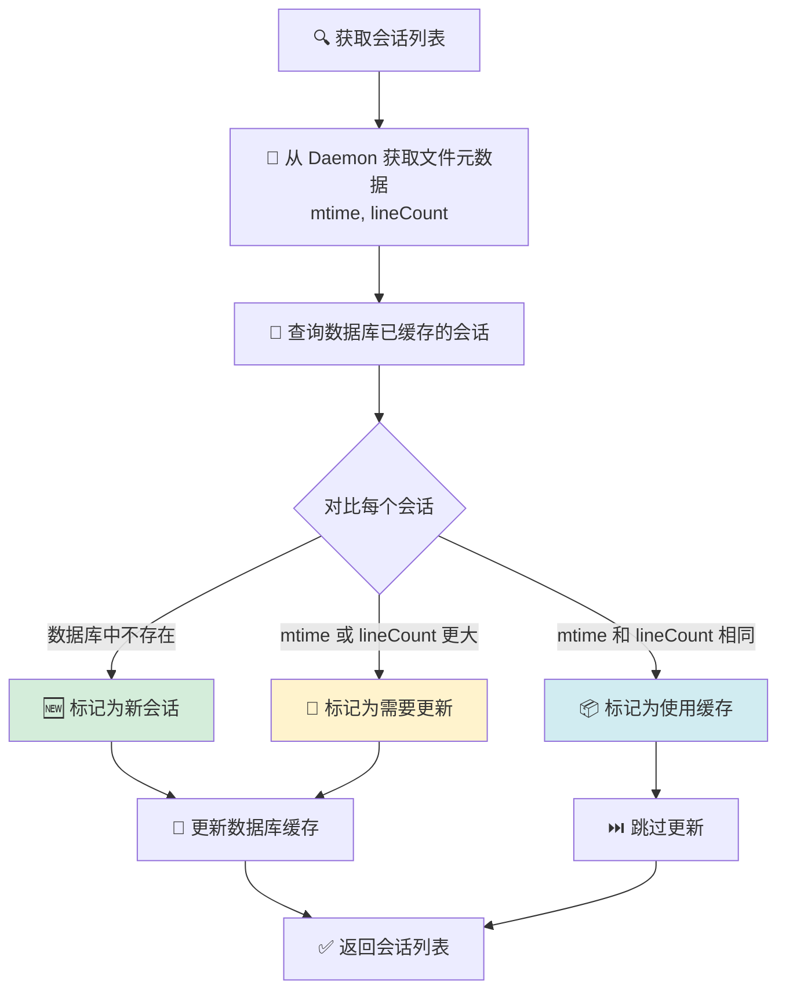
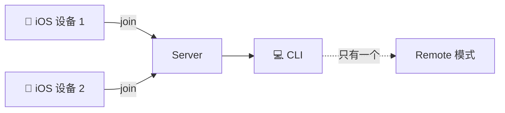

# Vlaude 系统架构流程图

> 使用支持 Mermaid 的工具查看此文档：
> - VS Code: 安装 "Markdown Preview Mermaid Support" 插件
> - Typora: 原生支持
> - 在线查看: https://mermaid.live/

---

## 1. 系统整体架构

```mermaid
graph TB
    subgraph "客户端层"
        CLI[CLI 终端]
        iOS[iOS App]
    end

    subgraph "服务层 (本地)"
        Server[Vlaude Server<br/>WebSocket Gateway<br/>Port: 10005]
        Daemon[Vlaude Daemon<br/>文件监听 + SDK<br/>Port: 10006]
    end

    subgraph "Claude 生态"
        ClaudeProcess[Claude CLI 进程]
        Transcript[Transcript 文件<br/>~/.claude/projects/]
        ClaudeAPI[Claude API]
    end

    CLI -->|WebSocket| Server
    iOS -->|WebSocket| Server
    Server -->|HTTP| Daemon
    Server -->|WebSocket<br/>双向通信| Daemon

    Daemon -->|fs.watch 监听| Transcript
    Daemon -->|SDK query()| ClaudeAPI
    ClaudeAPI -->|写入响应| Transcript

    CLI -->|spawn 子进程| ClaudeProcess
    ClaudeProcess -->|读写 JSONL| Transcript
```

**说明**:
- **CLI**: 用户在终端使用 Claude 的命令行工具
- **iOS App**: Swift 开发的移动端应用
- **Server**: 负责 WebSocket 路由和消息中转
- **Daemon**: 负责文件监听和 SDK 集成
- **Claude 进程**: 官方 Claude Code CLI
- **Transcript**: 会话记录文件 (JSONL 格式)

---

## 2. Local 模式 - 完整消息流程

### 场景：用户在 CLI 输入消息，iOS 实时查看



**关键点**:
1. ✅ CLI 直接运行 Claude 进程，用户可以正常交互
2. ✅ FileWatcher 监听文件变化，实时推送给 iOS
3. ✅ iOS 被动接收，只读模式

---

## 3. Remote 模式 - 切换流程

### 场景：iOS 发送第一条消息，CLI 切换到 Remote 模式



**关键点**:
1. ✅ iOS 乐观更新用户消息（本地显示）
2. ✅ CLI 杀掉 Claude 进程，进入 Remote 等待 UI
3. ✅ FileWatcher **暂停推送**但不停止监听
4. ✅ Daemon SDK 处理完后**主动推送** assistant 消息
5. ✅ 推送完成后**恢复** FileWatcher 推送

---

## 4. Remote 模式切回 Local

### 场景 A：用户在 CLI 按 'q' 退出 Remote



### 场景 B：iOS 断开连接，自动切回 Local



**关键点**:
1. ✅ CLI 重新启动 `claude --resume sessionId`
2. ✅ FileWatcher 一直在运行，无需重新启动
3. ✅ 用户可以继续在 CLI 输入

---

## 5. FileWatcher 推送控制机制



**状态管理**:
```typescript
// Daemon/SessionController
emit('session.pausePush', { sessionId })  // Remote 开始
emit('session.resumePush', { sessionId }) // Remote 结束

// Daemon/DataCollector
pausedSessions = new Set<string>()
// 推送前检查：if (pausedSessions.has(sessionId)) return
```

---

## 6. SDK 内部机制与消息过滤

### 6.1 SDK 自动生成的文件类型

当使用 `@anthropic-ai/claude-agent-sdk` 的 `query()` 方法时,SDK 会自动生成多种内部文件:

| 文件类型 | 用途 | 是否推送给客户端 | 是否显示在会话列表 |
|---------|------|-----------------|------------------|
| `type: user/assistant/system` | 真实对话消息 | ✅ 推送 | ✅ 显示 |
| `type: queue-operation` | 队列管理 (enqueue/dequeue) | ❌ 过滤 | ❌ 不显示 |
| `type: summary` | 会话摘要 | ❌ 过滤 | ❌ 不显示 |
| `type: checkpoint` | 状态快照 | ❌ 过滤 | ❌ 不显示 |
| `type: file-history-snapshot` | 文件历史记录 | ❌ 过滤 | ❌ 不显示 |
| `agent-*.jsonl` | Agent 子任务(Explore等) | ❌ 不推送 | ❌ 不显示 |

### 6.2 FileWatcher 过滤逻辑



**实现位置**:
- `vlaude-daemon/src/module/data-collector/data-collector.service.ts:354-366` (过滤 summary 和 agent 文件)
- `vlaude-daemon/src/module/data-collector/data-collector.service.ts:641-648` (过滤消息类型)

```typescript
// 1. 过滤 agent 文件和 summary 文件
if (file.endsWith('.jsonl') && !file.startsWith('agent-')) {
  const firstLine = await this.readFirstLine(sessionPath);
  const entry = JSON.parse(firstLine);
  if (entry.type === 'summary') {
    continue; // 跳过 summary 文件
  }
}

// 2. 过滤消息内部类型
.filter((msg) => {
  if (!msg.type) return true;
  const internalTypes = ['queue-operation', 'checkpoint', 'file-history-snapshot', 'summary'];
  return !internalTypes.includes(msg.type);
})
```

### 6.3 SDK Agent 预热机制

SDK 在执行 `query()` 时会自动创建 Explore Agent 进行任务预热:



**关键点**:
1. ✅ Agent 文件是 SDK 的内部机制,用户无需感知
2. ✅ FileWatcher 会过滤这些文件,不显示在会话列表中
3. ✅ queue-operation 用于追踪任务队列,也会被过滤

---

## 7. 增量更新策略

### 7.1 数据流优先级



### 7.2 增量更新判断逻辑

**实现位置**: `vlaude-server/src/module/session/session.service.ts:335-360`

```typescript
async categorizeSessions(daemonSessions) {
  const newSessions = [];
  const unchangedSessions = [];

  for (const daemonSession of daemonSessions) {
    const dbSession = await this.prisma.session.findUnique({
      where: { sessionId: daemonSession.sessionId }
    });

    if (!dbSession) {
      // 情况 1: 新会话,数据库中不存在
      newSessions.push(daemonSession);
    } else {
      const dbMtime = dbSession.lastMtime?.getTime() || 0;
      const daemonMtime = daemonSession.lastUpdated.getTime();
      const dbLineCount = dbSession.messageCount;
      const daemonLineCount = daemonSession.messageCount;

      if (dbMtime < daemonMtime || dbLineCount < daemonLineCount) {
        // 情况 2: 有更新 (文件更新时间更新或消息数增加)
        newSessions.push(daemonSession);
      } else {
        // 情况 3: 无变化,使用缓存
        unchangedSessions.push(daemonSession);
      }
    }
  }

  return { newSessions, unchangedSessions };
}
```

### 7.3 增量更新流程



**优点**:
1. ✅ 减少文件 I/O 操作
2. ✅ 提高响应速度
3. ✅ 保证数据一致性 (MAC 文件为准)

---

## 8. 关键组件职责矩阵

| 组件 | Local 模式 | Remote 模式 | 职责 |
|------|-----------|------------|------|
| **CLI** | 运行 Claude 进程 | 显示等待 UI | 模式切换、进程管理 |
| **Claude 进程** | 处理用户输入 | 不运行 | 与 Claude API 交互 |
| **Server** | 路由消息 | 路由消息 | WebSocket 中继 |
| **Daemon** | 监听文件推送 | SDK 处理消息 | 文件监听 + SDK 集成 |
| **FileWatcher** | 实时推送 | 暂停推送 | 检测文件变化 |
| **iOS** | 只读显示 | 发送 + 显示 | 用户交互 |

---

## 9. 消息类型对比

### Local 模式
```
用户消息: 不推送 (CLI 本地显示)
Assistant 消息: FileWatcher 推送给 iOS
```

### Remote 模式
```
用户消息: iOS 乐观更新 (本地显示)
Assistant 消息: Daemon 主动推送给 iOS
```

---

## 10. 潜在问题和讨论点

### ❓ 问题 1: 并发场景
**场景**: 两个 iOS 设备同时连接同一个 session


**当前行为**:
- `sessionClients[sessionId].swift` 是一个 Set
- 所有 Swift 设备都会收到消息
- 但多个设备同时发送消息会怎样？

**需要讨论**:
- 是否需要消息队列？
- 是否需要锁机制？

---

### ❓ 问题 2: 消息去重
**场景**: FileWatcher 推送 + Daemon 主动推送可能重复

**当前解决方案**: 暂停 FileWatcher 推送

**需要确认**:
- iOS 端是否需要额外的去重逻辑？
- 使用 message.uuid 去重？

---

### ❓ 问题 3: 错误恢复
**场景**: SDK 处理失败时

**当前逻辑**:
```typescript
catch (error) {
  // 恢复 FileWatcher
  emit('session.resumePush', { sessionId })
}
```

**需要讨论**:
- 是否需要重试机制？
- 失败消息如何通知 iOS？

---

### ❓ 问题 4: Session 生命周期
**场景**: CLI 退出后，iOS 是否继续监听？

**当前行为**:
- FileWatcher 继续运行（基于 iOS 订阅）
- 但没有 CLI，谁来处理消息？

**需要讨论**:
- 是否需要通知 iOS "CLI 已离线"？
- 是否允许 iOS 独立使用 SDK？

---

### ❓ 问题 5: FileWatcher 订阅计数
**当前逻辑**:
```typescript
subscriberCount++ // Swift subscribe
subscriberCount-- // Swift unsubscribe
// subscriberCount === 0 时关闭监听
```

**Remote 模式不影响订阅计数** ✅

**需要确认**: 这个设计是否合理？

---

## 11. 使用建议

### 查看此文档的方式

1. **VS Code** (推荐)
   ```bash
   # 安装插件
   code --install-extension bierner.markdown-mermaid
   # 打开预览
   # Cmd+Shift+V (Mac) 或 Ctrl+Shift+V (Windows)
   ```

2. **在线查看**
   - 访问 https://mermaid.live/
   - 复制 mermaid 代码块粘贴进去

3. **Typora**
   - 直接打开此文件即可看到图表

### 进一步讨论
请基于以上流程图提出你的疑问和建议！
